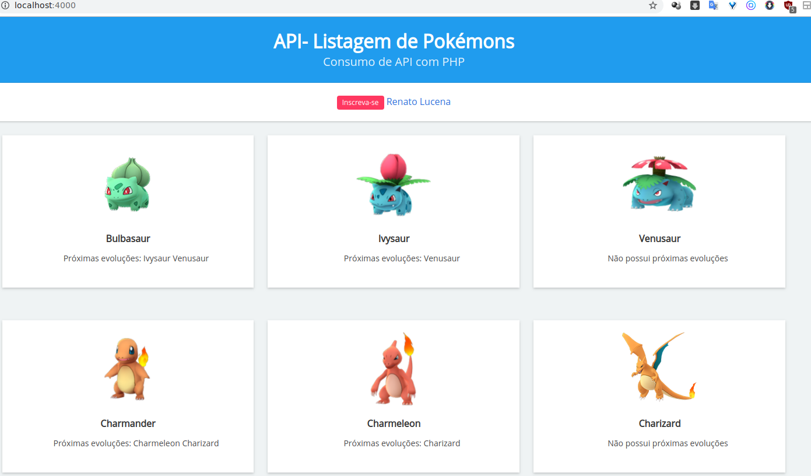

# Como consumir API com PHP — Pokemóns — Listar dados (file_get_contents e cURL)

## Consumindo API com PHP de Pokemóns — JSON

> Nesse exemplo, vamos consumir uma API de pokemóns retornando em JSON e listar os dados retornados, através do file_get_contents e cURL.
> A URL da API é: https://www.canalti.com.br/api/pokemons.json

- https://www.serebii.net/

## Consumindo API no PHP com file_get_contents
```
<?php
$url = "https://www.canalti.com.br/api/pokemons.json";
$pokemons = json_decode(file_get_contents($url));
?>
```

## Consumindo API no PHP com cURL
```
<?php
$url = "https://www.canalti.com.br/api/pokemons.json";

$ch = curl_init($url);
curl_setopt($ch, CURLOPT_RETURNTRANSFER, true);
curl_setopt($ch, CURLOPT_SSL_VERIFYPEER, false);
$pokemons = json_decode(curl_exec($ch));
?>
```

## Link com todas as opções para utilizar na função 
> curl_setopt: http://php.net/manual/pt_BR/function.curl-setopt.php

## Projeto final do consumo de API no PHP com cURL retornando uma listagem de Pokemóns

<p align="center"></p>

# Links úteis
- http://php.net/manual/pt_BR/function.file-get-contents.php
- http://php.net/manual/pt_BR/book.curl.php
- https://json.org
- https://addons.mozilla.org/pt-BR/firefox/addon/jsonview/
- https://bulma.io/
